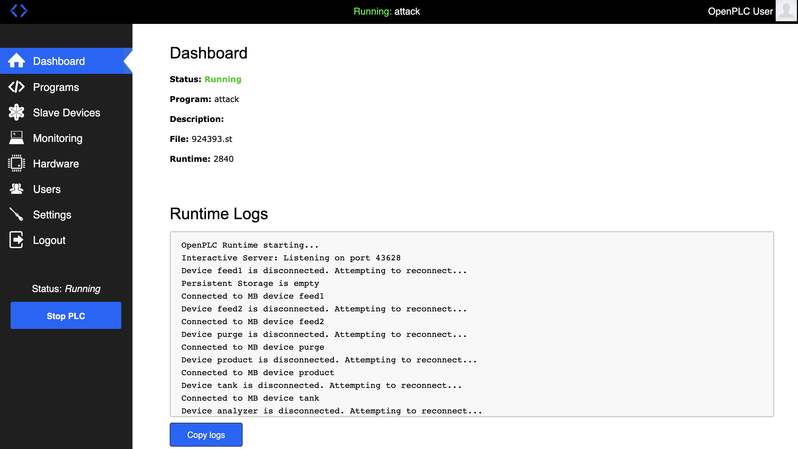
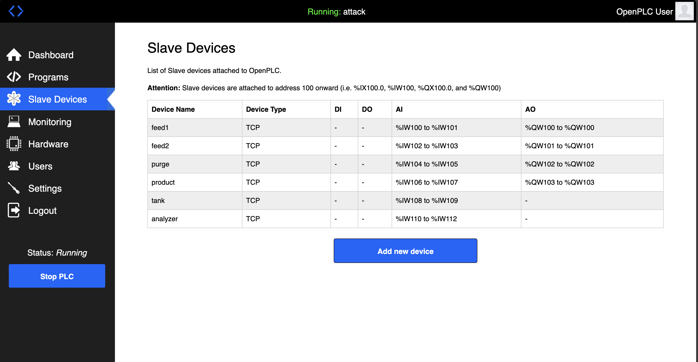

# OT SIEMENS WORKFLOW

## Instances

There are three instances that need to be set up for this experiment. The actual configuration is supposed to be like the following:

In the present stage the instances are all connected to the same network so that there is no need of firewall or router configuration to be setup explicitly to allow or restrict incoming or outgoing network traffic. Here we are allowing the communication to happen freely among the nodes without any barriers.

The openstack instances that are needed to be created are the following:
### CHEMICAL PLANT:
This instance runs the chemical plant simulation consisting of a reaction chamber connected to two feeds which supplys the reacting components. The product of the reaction is taken out of the system through the product outlet and the purge is taken out through the purge outlet. The control of the two feeds, the level, the product and the purge valves are very important to run the chemical reactor with stability. The following steps help setup the chemical reactor in the openstack:

* Press the launch icon on the [image description](https://cloud.isislab.vanderbilt.edu/ngdetails/OS::Glance::Image/d910e436-e4e1-4803-b3d1-40542acf691c), given on the openstack account of ISIS.
* m1-medium flavour will suffice.
* The remaining openstack configurations are pretty standard.
* Make sure to remove the port security to allow ssh.
* Use floating IP to SSH into the server.
* Make sure to perform `git pull` of the `GRFICSv2` folder, to ensure code update.
* Execute the bash executable file "~/GRFICSv2/simulation_vm/simulation/remote_io/modbus/run_all.sh".
* Now the chemical plant simulation and the visualizer will start running and can be visualized using the floating IP from any system within the VPN.

### PLC
This image is loaded on an instance to regulate the variables defined in the chemical plant viz. feed1 valve, feed2 valve, purge, pressure and level. The setpoints are prior set and the OPENPLC controller loaded in the instance will regulate the variables at the desired setpoints. All the software packages are installed and the necessary permissions are given. The set up instructions are as follows:
*  Press the launch icon on the [image description](https://cloud.isislab.vanderbilt.edu/ngdetails/OS::Glance::Image/baa761e8-d7f4-4557-952a-5fcc62d1cb1d), given on the openstack account of ISIS.
* m1-medium flavour and standard configurations.
* Remove the port security to enable SSH after allocating a floating IP.
* By default a OpenPLC controller will be running on the 8080 port of the instance.
* Access the OpenPLC dashboard from any browser within the VPN by connecting it to the `<floating IP Address:8080>` from the browser.
* Use the user id: openplc and password: openplc to access the dashboard.
* OpenPLC dashboard opens  as shown below:

* Navtigate to the Slave devices section of the dashboard within which you need to set up the IP address of the Modbus Slaves of the chemical plant.

* Double click on each of the slave devices and change their IP addresses to the IP address of the Chemical Plant instance (Not the Floating IP. Make sure not to use the floating IP.)
* Then return to the dashboard and restart the OpenPLC runtime.
* You must see the slave devices getting conected and the corresponding logs from the dashboard.
* Open monitoring tab to see the observable and control variables of the PLC.
* You can make the `attack` variable True for making the system unstable and `run_bit` to True for making the system shutdown. 
* In anycase if you want to restart the controller configuration, you can make the `first_run` variable to True to reset variables.

### Accessing the PLC to manipulate variables.

Download this git repository and run the python file `measurements.py`. This will create a `data.csv` file inside the execution folder which the `vis.py` access to visualize plots. This is important for the future implementation involving observations from the plant and plc.
* Defining attacks:
    * Integrity attack: There are six variables being sent to the modbus slaves from the master. All of these can be manipulated among which the most significant one is the pressure set-point. The effect of changing these variables can be imitated using the command `python write_PLC.py 65535 65535 0 0`.
    * Availablity: Among these six variables, some of them, if not available can induce instability. For example if you cut the transmission of all variables except feed1 and feed 2, the system will reach an unstable state. This can be imitated using running only the `feed1.py` and `feed2.py` codes present in the chemical plant instance after restarting the simulation.

